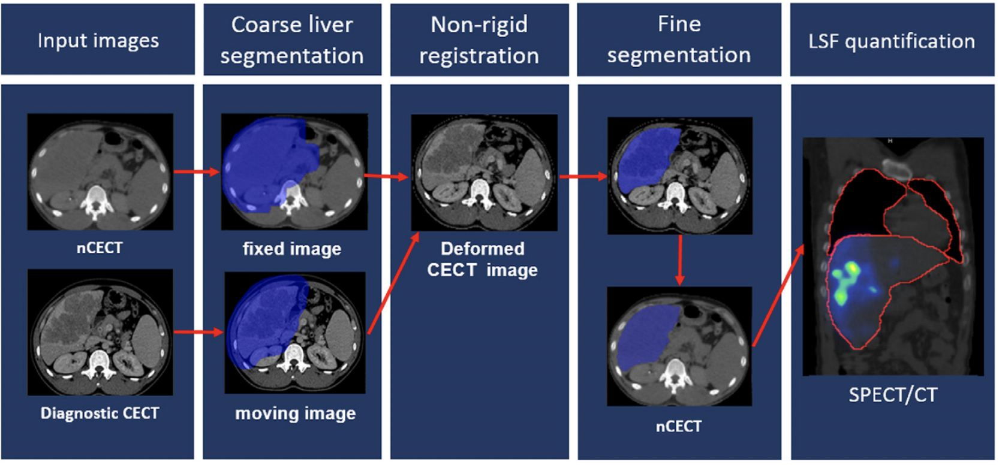
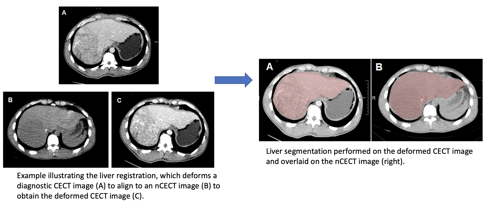
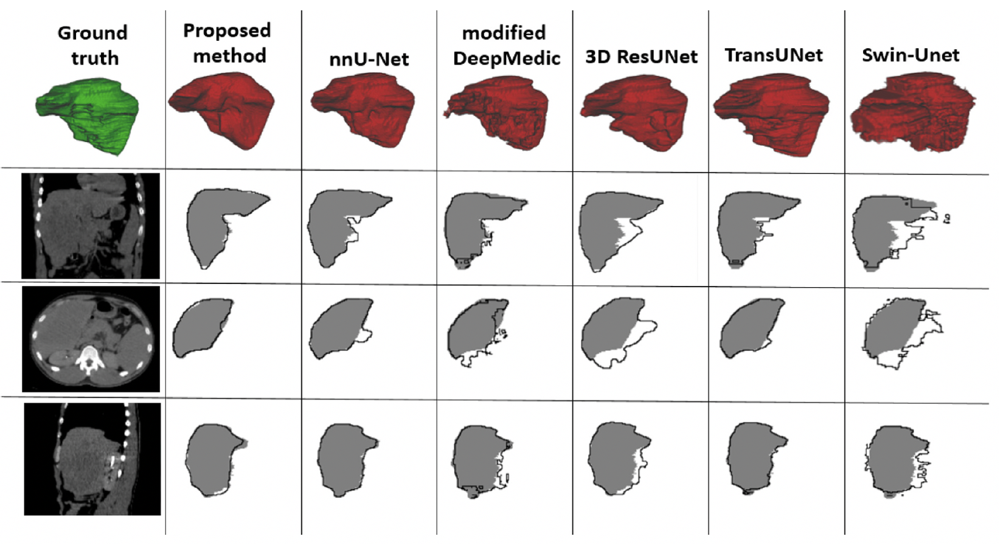
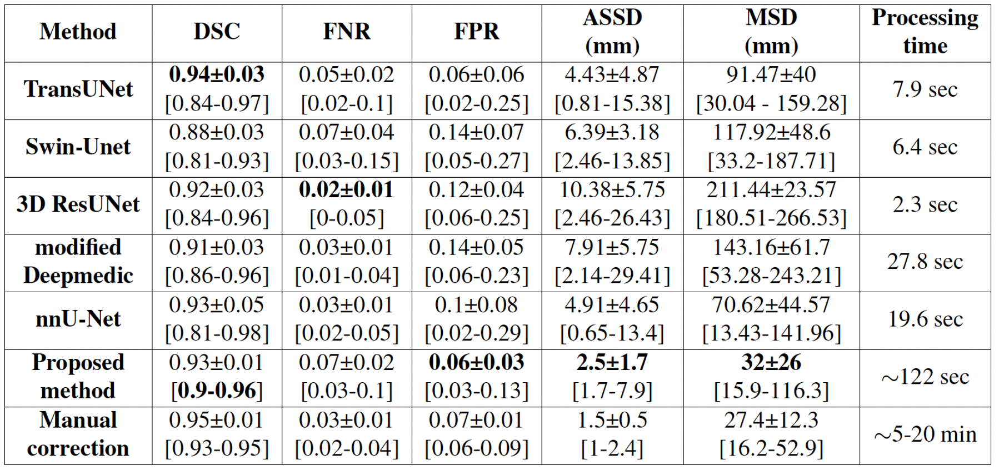

# Quantification of Liver-Lung Shunt Fraction on 3D SPECT/CT Images for Selective Internal Radiation Therapy of Liver Cancer Using CNN-Based Segmentations and Nonrigid Registration
By Manh Ha Luu, Hong Son Mai, Xuan Loc Pham, Quoc Anh Le, Quoc Khanh Le, Theo van Walsum, Ngoc Ha Le, Daniel Franklin, Vu Ha Le, Adriaan Moelker, Duc Trinh Chu, Trung Linh Nguyen.

Paper link: 
[[CMPB]](https://www.sciencedirect.com/science/article/abs/pii/S0169260723001190) 

Preprint open access version: 
[[SSRN]](https://papers.ssrn.com/sol3/papers.cfm?abstract_id=4247864) 

Demo link: 
[[Video_full]](https://www.youtube.com/watch?v=C0cJCaT_J7Q)
[[Video_short]](https://drive.google.com/file/d/1LyA-TOtnTtxfMiZpZ-RO6zTMJhyd15Zf/view?usp=drive_link)

# Introduction
Selective internal radiation therapy (SIRT) has been proven to be an effective treatment for hepatocellular carcinoma (HCC) patients. In clinical practice, the treatment planning for SIRT using Y90 microspheres requires estimation of the liver-lung shunt fraction (LSF) to avoid radiation pneumonitis.  Currently, the manual segmentation method to draw a region of interest (ROI) of the liver and lung in 2D planar imaging of 99mTc-MAA and 3D SPECT/CT images is inconvenient, time-consuming, and may be observer-dependent.

This study proposes and evaluates an automatic method for LSF quantification using 3D SPECT/CT images, offering improved performance compared with the current manual segmentation method.

# Method
We retrospectively acquired 3D SPECT with non-contrast-enhanced CT images (nCECT) of 60 HCC patients from a SPECT/CT scanning machine, along with the corresponding diagnostic contrast-enhanced CT images (CECT). Our approach for LSF quantification is to use CNN-based methods for liver and lung segmentations in the nCECT image. The pipeline is as follows:

- 3DResUnet for liver segmentation and dilate the segmentation to obtain liver mask as an ROI in the nCECT image. 
- Elastix-based non-rigid registration to deform the CECT liver to fit the shape of nCECT liver. 
- nnUNet-based accurate liver segmentation in the deformed CECT image. 

In addition, the lung segmentation is obtained using 3D ResUnet. Finally, LSF quantitation is performed based on the number of counts in the SPECT image inside the segmentations. 

This git contains the necessary material for the re-implementation of two models used in our work, which are 3DResUNet and nnUNet. For later reproduction of this work, here is the [link](https://drive.google.com/file/d/1Sr1IN1IcZid4azOSqsK5VYBj7KezhMjm/view?usp=sharing) for 3DResUNet weight and [link](https://drive.google.com/file/d/1lmYC6cbttZeHAoWidnGp1orTFjbmZHpG/view?usp=sharing) for nnUNet weight in this work. For specific details regarding installation, data preparation, model training and evaluation, please refer to the following github sources:
- [3DResUNet](https://github.com/assassint2017/MICCAI-LITS2017)
- [nnUnet](https://github.com/MIC-DKFZ/nnUNet)

In addition, the use and config file of Elastix for non-rigid registration in this work could be found in: 
- [Elastix](https://elastix.lumc.nl/index.php)
- *Elastix* folder

## 3DResUNet 
- The folder for 3DResUnet includes our trained weights in folder *weights* and model architecture in ResUNet.py
- Run eval_ds.py to quickly test the model with the example CT image in folder *data*  

## nnUNet 
- The folder for nnUNet includes our trained weights and its plan.
- Structure your data according to the [official nnUNet github](https://github.com/MIC-DKFZ/nnUNet) (add "_0000"), run data preprocessing command, and predict command to infer with our weights. 

## Hardware configuration
- 3DResUNet is quite lightweight and could be easily executed with either CPU or GPU (remember to disable cuda in case you want to try CPU). 
- nnUNet is more accurate but resource-consuming, therefore we highly recommend a system with GPU more than 8GB VRAM to run nnUNet
- The workstation in the paper has RTX8000 48GB VRAM GPU. Please read the paper to find detailed information regarding execution time and accuracy of each model. 

# Results
To evaluate the liver segmentation accuracy, we compared the proposed pipeline to five well-known CNN-based methods based on DSC, ASSD and MSD metrics. 

(1) Visual Comparision with state-of-the-art methods

(2) Numerical Comparision with state-of-the-art methods

